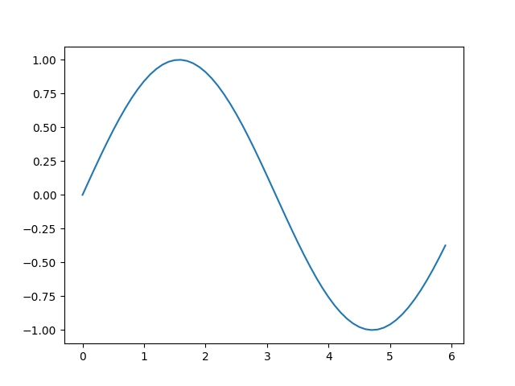
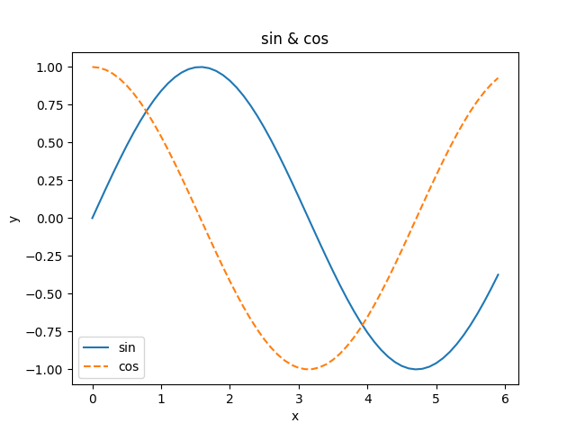
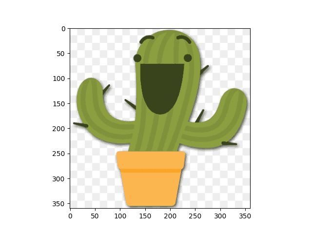

# Chap01 Hello Python


## 1.3.1 산술연산
```
- 사칙연산(+, -, *, /)
- 거듭제곱(**)
 *파이썬2에서는 정수끼리 계산한 결과는 정수(ex. 7÷5의 결과는 1)
 *파이썬3에서는 정수를 나눈 결과는 실수(부동소수점) 
```

## 1.3.2 자료형
```
- type() 을 사용하여 특정 데이터 자료형을 확인 가능하다.
type(10)    -> <class 'int'>   정수
type(2.718) -> <class 'float'>   실수
type("hello")   -> <class 'str'>   문자열
```

## 1.3.3 변수
```
변수의 정의 : 
x = 10
y = 3.14
print(x)
```

## 1.3.4 리스트
```
a = [1, 2, 3, 4, 5]    리스트 생성
len(a)   -> 5       리스트 길이 확인
a[0]     -> 1       리스트 인덱스를 활용한 색인
a[4]     -> 5
a[4] = 99           리스트 인덱스를 활용한 데이터 수정
print(a)  -> [1, 2, 3, 4, 99]
print(a[1:])   -> [2, 3, 4, 99]       리스트 슬라이싱을 통한 부분 추출
print(a[:3])   -> [1, 2, 3] 
print(a[:-1])   -> [1, 2, 3, 4]       리스트의 마지막 원소의 인덱스는 '-1'
print(a[:-2])   -> [1, 2, 3] 
```

## 1.3.5 딕셔너리
```
me = {'height' : 100}
me['height']    -> 180
me['weight']
print(me)   -> {'weight': 70, 'height': 180}
```

## 1.3.6 bool(boolean)
```
hungry = True
sleepy = False
type(hungry)    -> <class 'bool'>
not hungry     -> False
hungry and sleepy    -> False
hungry or sleepy     -> True
```

## 1.3.7 if문
```
hungry = True
if hungry : 
    print("I'm hungry")     -> I'm hungry

hungry = False 
if hungry : 
    print("I'm hungry")
else : 
        print ("I'm not hungry")
        print ("I'm sleepy")     -> I'm not hungry
                                    I'm sleepy
```

## 1.3.8 for문
```
for i in [1, 2, 3]:
    print(i)
1
2
3
```

## 1. 3. 9 함수
```
def hello():
    print("Hello World!")

hello()         -> Hello World!

함수에 인수넣어 적용하기
def hello(object):
    print("Hello " + object + "!")

hello("cat")         -> Hello cat!
```


## 1.4.2 클래스
```클래스의 구조
class 클래스 이름:
    def __init__(self, 인수, ...):      # 생성자(Constructor) : 클래스 초기화하는 방법 정의
        ...
    def 메서드 이름1(self, 인수, ...):     # 메서드1
        ...
    def 메서드 이름1(self, 인수, ...):      # 메서드2
        ...

class Man:
    def __init__(self, name):       # Man의 생성자는 name이라는 인수를 받고
        self.name = name            # 받은 인수 name으로 인스턴스 변수인 self.name 초기화   *인스턴스 변수 : 인스턴스별로 저장되는 변수
        print("Initialized")

    def hello(self):
        print("Hello" + self.name + "!")

    def goodbye(self):
        print("Good-bye" + self.name + "!")

m = Man("David")
m.hello()
m.goodbye()
```

## 1.5 넘파이(Numpy)

## 1.5.3 넘파이 배열 생성/산술연산
```
>>> import numpy as  np     # 라이브러리 가져오기
>>> y = np.array([2.0, 4.0, 6.0])
>>> x = np.array([1.0, 2.0, 3.0])
>>> x+y
array([3., 6., 9.])
>>> x-y 
array([-1., -2., -3.])
>>> x*y
array([ 2.,  8., 18.])
>>> x/y
array([0.5, 0.5, 0.5])
*넘파이 연산시 원소 수가 동일해야 한다.
*원소별(element-wise)
*넘파이 배열과 수치 하나(스칼라값)의 조합으로 된 산술연산 : 브로드캐스트
```
## 1.5.4 넘파이의 N차원 배열
```
>>> A = np.array([[1,2], [3,4]])
>>> print(A)
[[1 2]
 [3 4]]
>>> A.shape        행렬의 형상
(2, 2)
>>> A.dtype         행렬에 담긴 원소의 자료형
dtype('int32')

# 넘파이 배열간 산술연산
>>> B = np.array([[3,0], [0, 6]])
>>> A+B
array([[ 4,  2],
       [ 3, 10]])
>>> A*B
array([[ 3,  0],
       [ 0, 24]])

# 넘파이 배열의 브로드캐스트
>>> print(A)
[[1 2]
 [3 4]]
>>> A*10
array([[10, 20],
       [30, 40]])

여기서 10은 연산될 때 아래와 같은 배열로 변환되어 연산된다.
[[ 10, 0],
 [  0, 0]]
```

## 1.5.5 브로드캐스트
```
>>> A = np.array([[1,2], [3,4]])
>>> B = np.array([10,20]) 
>>> A*B
array([[10, 40],
       [30, 80]])

여기서 배열 B는 아래와 같은 배열로 변환되어 연산된다.
[[10, 20],
 [ 0,  0]]
```

## 1.5.6 원소 접근
```
원소에 대한 접근은 인덱스를 활용한다.
>>> X = np.array([[51, 55], [14, 19], [0, 4]]) 
>>> print(X)
[[51 55]
 [14 19]
 [ 0  4]]
>>> X[0]
array([51, 55])
>>> X[0][1]
55

# for 문으로 각 원소에 접근할 경우
>>> for row in X:
...     print(row)
... 
[51 55]
[14 19]
[0 4]

# 배열 평탄화
>>> Y = X.flatten()
>>> print(Y)
[51 55 14 19  0  4]

# 인덱스가 0, 2, 4인 원소 얻기
>>> Y[np.array([0, 2, 4])]
array([51, 14,  0])
```


# 1.6 matplotlib
## 1.6.1 단순한 그래프 그리기
sin함수 그래프 그리기
```
>>> import numpy as np
>>> import matplotlib.pyplot as plt
>>>
>>> x = np.arange(0, 6, 0.1)
>>> y = np.sin(x)
>>>
>>> plt.plot(x, y) # 그래프 그리기
[<matplotlib.lines.Line2D object at 0x00000227EAB31ED0>]
>>> plt.show()
```


## 1.6.2 pyplot의 기능
sin함수와 cos함수 그래프 그리기
```
>>> import numpy as np
>>> import matplotlib.pyplot as plt
```

데이터 준비
```
>>> x = np.arange(0, 6, 0.1)
>>> y1 = np.sin(x)
>>> y2 = np.cos(x)
```

그래프 그리기
```
>>> plt.plot(x, y1, label='sin')
[<matplotlib.lines.Line2D object at 0x00000227EDF468C0>]
>>> plt.plot(x, y2, linestyle="--", label='cos')        # cos 함수는 점선으로 그리기
[<matplotlib.lines.Line2D object at 0x00000227EDF46F50>]
>>> plt.xlabel("x")         # x축 이름
Text(0.5, 0, 'x')
>>> plt.ylabel("y")         # y축 이름
Text(0, 0.5, 'y')
>>> plt.title('sin & cos')      # 제목
Text(0.5, 1.0, 'sin & cos')
>>> plt.legend()            # legend 표시
<matplotlib.legend.Legend object at 0x00000227EDF46CB0>
>>> plt.show()              # 그래프 출력
```



## 1.6.3 이미지 표시하기
```
>>> import matplotlib.pyplot as plt
>>> from matplotlib.image import imread
>>>
>>> img = imread('cactus.png')      # 현재 경로에 저장된 cactus.png 파일을 읽어오기
>>>
>>> plt.imshow(img)             # 이미지 표시
<matplotlib.image.AxesImage object at 0x00000227EDFBFD60>
>>> plt.show()              # 좌표평면이 표시되는 결과창 표시
```

