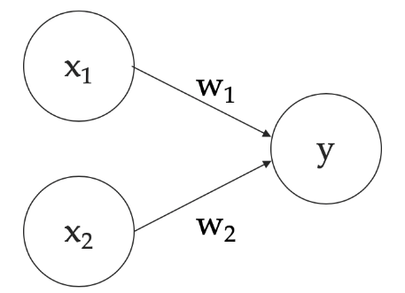
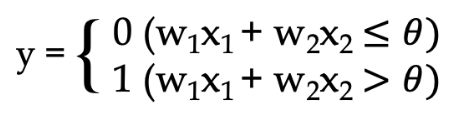
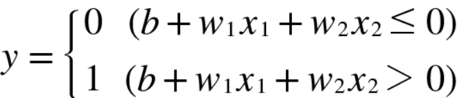
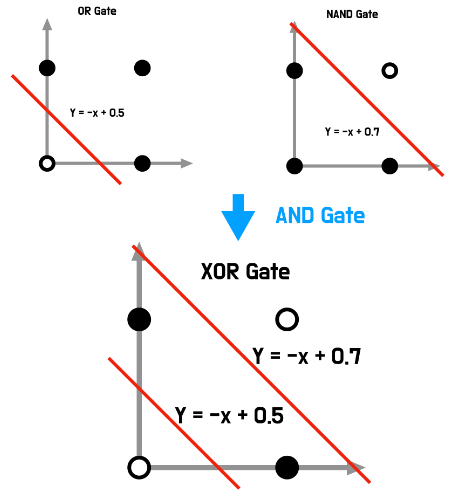
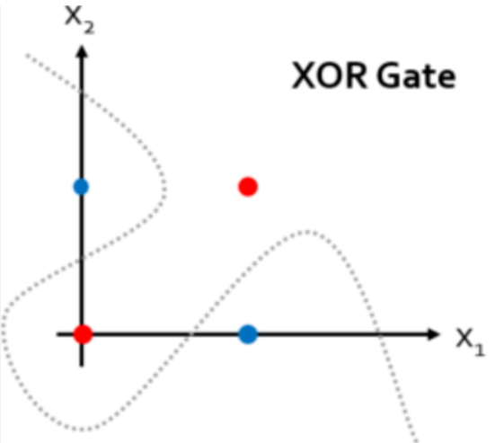
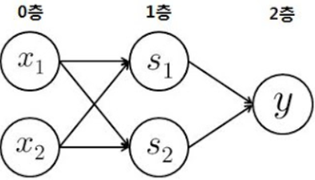

# Chap02 Perceptron

### 퍼셉트론(Perceptron)

프랑크 로젠블라트가 1957년에 고안한, 신경망(딥러닝)의 기원이 되는 알고리즘

## 2.1 퍼셉트론이란?

다수의 신호를 입력으로 받아 하나의 신호를 출력한다.

퍼셉트론 신호는 '흐른다(1)/흐르지 않는다(0)'의 두 가지 값을 가진다.

- x1, x2는 입력신호

- w1, w2는 가중치(weight)   *가중치가 클 수록 해당 신호가 그만큼 더 중요함을 뜻함

- y는 출력신호

- 그림의 각 원은 뉴런 혹은 노드라고 부른다.

- 뉴런에서 보내온 신호의 총합이 정해진 한계를 넘어설 때만 1을 출력하며, 그 한계를 임계값(θ, theta)이라고 한다.

## 2.2 단순한 논리 회로
### 2.2.1 AND 게이트

AND 게이트는 입력이 둘, 출력은 하나

AND 게이트 : 입력 신호가 모두 1일 경우 출력이 1이 되는 신호

AND 게이트의 진리표

|x1|x2|y|
|-|-|-|
|0|0|0|
|1|0|0|
|0|1|0|
|1|1|1|

위의 진리표를 퍼셉트론으로 표현하고 싶다?

▶ 진리표대로 작동하는 w1, w2, θ의 값을 정해야 한다.

### 2.2.2 NAND 게이트와 OR 게이트

NAND게이트 = Not AND = AND 게이트의 출력을 뒤집은 것

|x1|x2|y|
|-|-|-|
|0|0|1|
|1|0|1|
|0|1|1|
|1|1|0|

OR 게이트 : 입력 신호 중 하나 이상이 1이면 출력이 1이 되는 논리 회로

|x1|x2|y|
|-|-|-|
|0|0|0|
|1|0|1|
|0|1|1|
|1|1|1|

여기서 중요한 점은 퍼셉트론의 구조는 AND, NAND, OR 게이트 모두에서 같으며, 다른 점은 매개변수(가중치와 임계값)의 값 뿐이다.

## 2.3 퍼셉트론 구현하기

### 2.3.1 간단한 구현부터

[※ AND 게이트 논리회로 구현 _ ch02_src_code_01.py](./src/ch02_src_code_01.py)

### 2.3.2 가중치와 편향 도입

θ를 -b(편향, bias)로 치환하면 퍼셉트론 동작이 아래와 같이 변환된다.

퍼셉트론은 입력 신호에 가중치를 곱한 값과 편향을 합하여, 그 값이 0을 넘으면 1을 출력하고 그렇지 않으면 0을 출력한다.

[※ 퍼셉트론 동작(가중치, 편향) _ ch02_src_code_02.py](./src/ch02_src_code_02.py)

### 2.3.3 가중치와 편향 구현하기

[※ AND, NAND, OR게이트 퍼셉트론 구현 _ ch02_src_code_03.py](./src/ch02_src_code_03.py)

## 2.4 퍼셉트론의 한계

### 2.4.1 도전! XOR 게이트

XOR 게이트는 배타적 논리합이라는 논리회로이다. x1과 x2중 한 쪽이 1일때만 1을 출력한다.

|x1|x2|y|
|-|-|-|
|0|0|0|
|1|0|1|
|0|1|1|
|1|1|0|

OR 게이트와 NAND 게이트를 시각화 하면 아래와 같이 직선으로 나뉜 두 영역으로 표현이 가능하지만 XOR 게이트는 하나의 직선으로는 표현이 불가능하다.

### 2.4.2 선형과 비선형
그러나! 직선이라는 제약을 없앤다면 어떨까?

아래 그림과 같은 곡선의 영역을 비선형 영역, 직선의 영역은 선형 영역이라고 한다.

## 2.5 다층 퍼셉트론이 출동한다면

위와 같은 이유로 1-layer 퍼셉트론으로는 XOR 게이트를 표현할 수 없다. 하지만 이를 쌓아서 '다층 퍼셉트론(multi-layer perceptron)'으로 구성할 수 있다.

### 2.5.1 기존 게이트 조합하기

기존에 알고있는 AND, NAND, OR 게이트를 조합하면 아래와 같이 XOR 게이트처럼 작동하는 구조를 만들 수 있다.

진리표는 아래와 같다.

|x1|x2|s1|s2|y|
|-|-|-|-|-|
|0|0|1|0|0|
|1|0|1|1|1|
|0|1|1|1|1|
|1|1|0|1|0|

### 2.5.2 XOR 게이트 구현하기

[※ XOR게이트 퍼셉트론 구현 _ ch02_src_code_04.py](./src/ch02_src_code_04.py)

## 2.6 NAND에서 컴퓨터까지

놀랍게도 컴퓨터 내부에서 이뤄지는 처리는 NAND 게이트의 조합만으로도 재현할 수 있다.

이 말은 곧 2층 이상 퍼셉트론으로 컴퓨터를 표현할 수 있다는 사실로 귀결된다.

2층 퍼셉트론 퍼셉트론, 정확히는 비선형인 시그모이드 함수를 활성화 함수로 이용하면 임의의 함수를 표현할 수 있다.(3장 참고)

그러나 2층 퍼셉트론 구조에서 가중치를 적절히 설정하는 부분은 쉽지 않다.

# Summary

- 퍼셉트론은 입출력을 갖춘 알고리즘이다. 입력을 주면 정해진 규칙에 따른 값을 출력한다.
- 퍼셉트론에서는 '가중치'와 '편향'을 매개변수로 설정된다.
- 퍼셉트론으로 AND, OR 게이트 등의 논리회로를 표현할 수 있다.
- XOR 게이트는 단층 퍼셉트론으로는 표현할 수 없다.
- 2층 퍼셉트론을 이용하면 XOR 게이트를 표현할 수 있다.
- 단층 퍼셉트론은 직선형 영역만 표현할 수 있고, 다층 퍼셉트론은 비선형 영역도 표현할 수 있다.
- 다층 퍼셉트론은 (이론상) 컴퓨터를 표현할 수 있다.