# Chap03 신경망(Neural Network)

앞선 챕터에서는 퍼셉트론을 활용해 복잡한 함수도 표현 가능하다는 점을 알 수 있었다. 하지만 여전히 가중치를 설정하는 작업은 사람이 수동으로 해야 하는 점이 남아있다.

이를 해결하기 위해 신경망이 좋은 해답이 된다.

신경망의 중요한 성질 중 하나는 가중치 매개변수의 적절한 값을 데이터로부터 자동으로 학습하는 능력이 있다는 점이다.

## 3.1 퍼셉트론에서 신경망으로

### 3.1.1 신경망의 예

신경망은 입력층(0층), 은닉층(1층), 출력층(2층)으로 구성된다. 여기서 은닉층은 사람 눈에는 보이지 않는 부분을 말한다.

층 번호는 0부터 시작하는데 그 이유는 파이썬 인덱스와 동일하게 표현하기 위함이다.

### 3.1.2 퍼셉트론 복습

 

간단한 단층 퍼셉트론에 편향을 표시하면 아래와 같이 표기할 수 있다.

 

위 그림은 가중치가 b이고 입력이 1인 뉴런, 즉 x1, x2, 1이라는 3개의 신호가 뉴런에 입력되어, 각 신호에 가중치를 곱한 후 다음 뉴런에 전달되는 구조이다.

위의 수식은 아래와 같이 다시 표현할 수 있다. 조건 분기의 동작(0을 넘으면 1을 출력하고 그렇지 않으면 0을 출력)을 하나의 함수로 나타내고 이 함수를 h(x)로 표현한다.

 

위 식에서 입력 신호의 총합이 h(x)라는 함수를 거쳐 변환되어, 그 변환된 값이 y의 출력이 됨을 보여준다. 이 함수는 입력이 0을 넘으면 1을, 그렇지 않으면 0을 돌려준다.

**※ ↑ 이 부분 추가 이해 필요**

- 위 식에서 x는 x1, x2를 통칭해서 어떤 값이든 입력이 되는 값을 칭하는 것인가?

### 3.1.3 활성화 함수의 등장

위의 h(x)라는 함수와 같이 입력 신호의 총합을 출력 신호로 변환하는 함수를 일반적을 **활성화 함수(Activation function)**라고 한다. '활성화'라는 이름이 말해주듯 활성화 함수는 입력 신호의 총합이 활성화를 일으키는지를 정하는 역할을 한다.

앞서 보았던 식을 다시 표현하면 아래와 같다.

1) a : 가중치가 달린 입력신호와 편향의 총 합

 

2) a를 함수 h()에 넣어 y를 출력하는 흐름

 

활성화 함수의 처리과정을 도식화하면 아래와 같이 표현된다.

 

이해한 바로는 앞서 가중치와 신호로 계산된 b+(w1*x1)+(w2*x2)가 a라는 노드로 계산되고 이를 함수 h()에 넣어 y라는 노드로 출력되는 모습이다. (*여기서 '뉴런 =노드'로 표현된다.)

## 3.2 활성화 함수

앞서 보았던 아래 함수를 잘 들여다보면 입력값(x)이 특정 임계값(여기서는 0)을 경계로 출력값(0~1)이 바뀌는데, 이런 함수를 **계단 함수(Step function)**라고 한다.

 

그래서 ***"퍼셉트론에서는 활성화 함수로 계단함수를 이용한다"*** 라고 할 수 있다.

퍼셉트론은 계단함수를 채용하고 있지만, ***신경망에서는 활성화 함수를 계단함수에서 다른 함수로 변경함***으로써 활용할 수 있다.

### 3.2.1 시그모이드 함수(Sigmoid function)

 

신경망에서는 활성화 함수로 위와 같은 ***시그모이드 함수***를 이용하여 신호를 변환하고, 그 변환된 신호를 다음 뉴런에 전달한다.

### 3.2.2 계단함수 구현하기

[※ 계단함수 구현 _ ch03_src_code_01.py](./src/ch03_src_code_01.py)

이 구현에서 주의할 점은, 인수 x를 실수(부동소수점)만 받아들인다는 점이다. 즉 step_function(3.0)은 계산 가능하지만, <u>넘파이 배열은 인수로 넣을 수 없다.</u>

이를 위해 소스코드를 아래와 같이 수정할 수 있다.

[※ 계단함수 구현(2) _ ch03_src_code_02.py](./src/ch03_src_code_02.py)

위의 코드에서처럼 넘파이 배열의 자료형을 변환할 때는 astype() 메서드를 사용할 수 있다.

### 3.2.3 계단 함수의 그래프

[※ 계단함수 그래프 출력 _ ch03_src_code_03_step_function.py](./src/ch03_src_code_03_step_function.py)

 

### 3.2.4 시그모이드 함수 구현하기

[※ 시그모이드 함수 구현 _ ch03_src_code_04_sigmoid.py](./src/ch03_src_code_04_sigmoid.py)

이 함수가 정상적으로 동작하는 이유는 **넘파이의 브로드캐스트** 기능 덕분이다.

즉, 넘파이 배열과 스칼라값의 연산을 넘파이 배열의 원소 각각과 스칼라값의 연산으로 바꿔 수행하는 것이다.

[※ 시그모이드 함수 그래프 출력 _ ch03_src_code_05.py](./src/ch03_src_code_05.py)

 

### 3.2.5 시그모이드 함수와 계단 함수 비교

[※ 시그모이드 함수와 계단함수 비교 _ ch03_src_code_06.py](./src/ch03_src_code_06.py)

 

시그모이드 함수는 계단함수와 비교하여 연속적인 곡선형태를 갖는다. 

### 3.2.6 비선형 함수

계단함수와 시그모이드 함수는 *비선형 함수*라는 점에서 공통점을 가진다. (시그모이드 - 곡선, 계단함수 - 구부러진 직선)

**신경망에서는 활성화 함수로 비선형 함수를 사용해야 한다. 그 이유는 선형 함수를 사용하면 신경망 층을 깊게 하는 의미가 없어지기 때문이다**

- h(x) = cx를 활성화 함수로 사용한 3층 네트워크를 예로 들었을 때, y(x) = h(h(h(x)))가 되며, 계산해보면 y(x) = c * c * c * x 처럼 곱셈을 세 번 수행하는, 즉, y(x) = ax (a = c^3)과 동일한 식이 되기 때문이다.

### 3.2.7 ReLU(Rectified Linear Unit) 함수

ReLU는 입력이 0을 넘으면 그 입력을 그대로 출력하고, 0 이하이면 0을 출력하는 함수이다.

 

 

[※ ReLU함수 구현 _ ch03_src_code_07_relu.py](./src/ch03_src_code_07_relu.py.py)

## 3.3 다차원 배열의 계산

### 3.3.1 다차원 배열

다차원 배열 : 숫자가 한 줄로 늘어선 것이나 직사각형으로 늘어놓은 것. 3차원으로 늘어놓은 것이나 (더 일반화한) N차원으로 나열하는 것을 통틀어 다차원 배열이라고 한다.

[※ numpy를 활용한 행렬 구현 _ ch03_src_code_08.py](./src/ch03_src_code_08.py)

### 3.3.2 행렬의 곱

[※ numpy를 활용한 행렬의 곱 구현 _ ch03_src_code_09.py](./src/ch03_src_code_09.py)

행렬의 곱은 np.dot()을 사용한다.

*주의할 점은 행렬의 곱은 연산순서가 다를 경우 다른 결과가 나올 수 있다.

 (ex. np.dot(A, B) != np.dot(B, A))

 [※ 형상이 다른 행렬의 곱 구현 _ ch03_src_code_10.py](./src/ch03_src_code_10.py)

형상이 다른 행렬의 곱에서는 행렬의 형상에 주의해야 한다. 예를 들면 행렬곱 A*B를 계산할 때 A의 1번째 차원의 원소 수(열 수)와 행렬 B의 0번째 차원의 원소 수(행 수)가 같아야 한다.

### 3.3.3 신경망에서의 행렬 곱

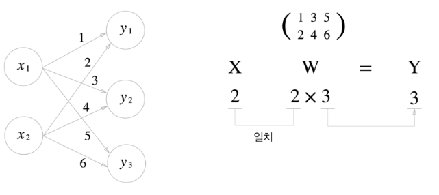 

 [※ 신경망에서의 행렬 곱 _ ch03_src_code_11.py](./src/ch03_src_code_11.py)

## 3.4 3층 신경망 구현하기

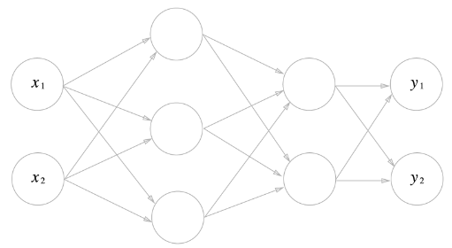 

### 3.4.1 표기법 설명

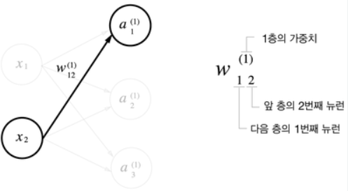 

### 3.4.2 각 층의 신호 전달 구현하기

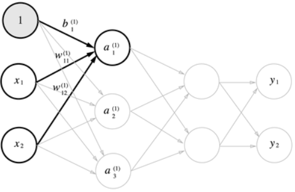 

2층의 첫 번째 뉴런을 수식으로 나타내면 아래와 같다.

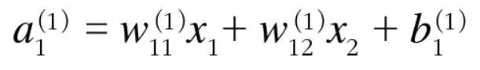 

행렬의 곱을 이용하여 위 식을 아래와 같이 간소화 가능하다.

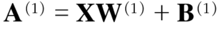 

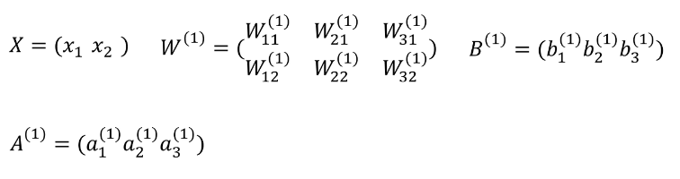 

입력층에서 1층으로의 신호 전달

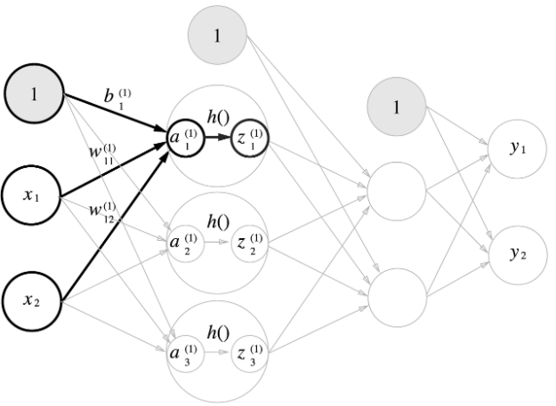 

은닉층에서의 가중치 합(가중 신호와 편향의 총합)을 a로 표기하고 활성화 함수 h()로 변환된 신호를 z로 표기한다. 여기에서 활성화 함수로 시그모이드 함수를 사용한다.

[※ 신경망 1층 계산 _ ch03_src_code_12.py](./src/ch03_src_code_12.py)

1층에서 2층으로의 신호 전달

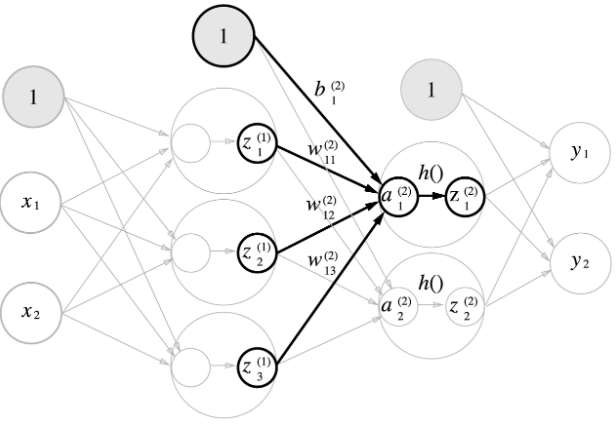 

[※ 신경망 2층 계산 _ ch03_src_code_13.py](./src/ch03_src_code_13.py)

2층에서 출력층으로의 신호 전달

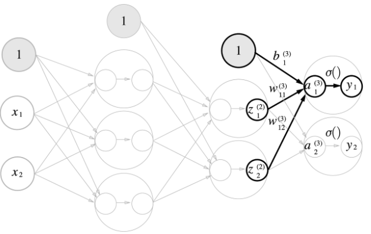 

[※ 신경망 출력층 계산 _ ch03_src_code_14_identity_function.py](./src/ch03_src_code_14_identity_function.py.py)

*여기서는 항등함수 identity_function()을 정의하고, 이를 출력층의 활성화 함수로 이용하였다.

항등함수(Identity function) : 입력과 출력이 같은 함수

*출력층의 활성화 함수는 σ()로 표시하여 은닉층의 활성화 함수 h()와 구분하였다.

### 3.4.3 구현 정리

[※ 신경망 계산 _ ch03_src_code_15_init_network,forward.py](./src/ch03_src_code_15_init_network,forward.py)

여기서 init_network() 함수는 가중치와 편향을 초기화하고 이들을 딕셔너리 변수 network에 저장한다.

network에서는 각 층에 필요한 매개변수(가중치와 편향)를 저장한다.

forward()함수는 입력 신호를 출력으로 변환하는 처리과정을 구현한다.

## 3.5 출력층 설계하기

일반적으로 회귀(Regression)에는 항등함수를, 분류(Classification)에는소프트맥스 함수를 활성화함수로 한다.

### 3.5.1 항등함수와 소프트맥스 함수 구현

소프트맥스 함수(Softmax function)

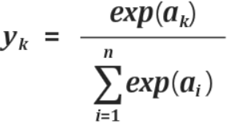 

(n은 출력층의 뉴런 수)

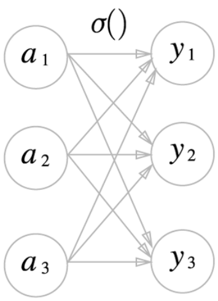 

수식의 분모부분을 보면 알 수 있듯이, 출력층의 각 뉴런은 모든 입력신호로부터 영향을 받는다.

[※ softmax함수 예시 _ ch03_src_code_16](./src/ch03_src_code_16.py)

[※ softmax함수 정의 _ ch03_src_code_17.py](./src/ch03_src_code_17.py)

### 3.5.2 소프트맥스 함수 구현시 주의점

src_code_17의 식은 지수함수를 이용하는데, a값이 너무 커지게되면 exponential 특성상 매우 큰 값을 출력하게 되고 이는 곧 inf(무한대)로 출력하게 된다. 이를 오버플로라고 한다.

이를 보완하기 위해 식을 아래와 같이 개선할 수 있다.

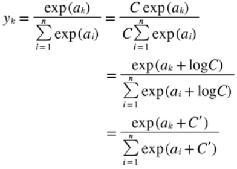 

위 식이 의미하는 바 : 소프트맥스 지수함수를 계산할 때 어떤 정수를 더하거나 빼도 결과는 동일하다.

이는 오버플로를 막기 위해 C'에 입력 신호 중 최대값을 대입하여 보완하는데 이용할 수 있다.

[※ 오버플로 보완 _ ch03_src_code_18.py](./src/ch03_src_code_18.py)

[※ softmax함수 재정의 _ ch03_src_code_19.py](./src/ch03_src_code_19.py)

### 3.5.3 소프트맥스 함수의 특징

- 소프트맥스 함수의 출력은 0에서 1.0 사이의 실수이다.
- 소프트맥스 함수 출력의 총 합은 1이다. 이 성질은 소프트맥스 함수의 출력을 '확률'로 해석이 가능하게 한다. (????)
- 소프트맥스 함수는 단조 증가함수이기 때문에 함수를 원소에 적용해도 각 원소의 대소관계는 변하지 않는다.
- 소프트맥스 함수를 적용해도 출력이 가장 큰 뉴런의 위치는 달라지지 않기 때문에, 신경망으로 분류할 때는 출력층의 소프트맥스 함수를 생략해도 된다.

### 3.5.4 출력층의 뉴런 수 정하기

- 출력층의 뉴런 수는 ***분류하고 싶은 클래스 수***로 설정하는 것이 일반적이다.

## 3.6 손글씨 숫자 인식

기계학습과 마찬가지로 신경망도 두 단계를 거쳐 문제를 해결한다.

- 1) 훈련 데이터(학습 데이터)를 사용해 가중치 매개변수 학습
- 2) 앞서 학습한 매개변수를 사용하여 입력데이터를 분류하는 추론단계 → 신경망의 순전파(Forward propagation)

### 3.6.1 MNIST 데이터셋

원 핫 인코딩 : 정답을 뜻하는 원소만 1이고(hot하고) 나머지는 모두 0인 배열
one_hot_label이 False이면 '7'이나 '2'와 같이 숫자 형태의 레이블을 저장하고, True 일때는 레이블을 원-핫 인코딩하여 저장한다.

mnist.py 파일을 살펴보면 'load_mnist' 라는 함수를 불러와 사용할 수 있다.

아래와 같은 형식으로 Load하여 사용할 수 있다.

- (x_train, t_train), (x_test, t_test) = load_mnist(normalize=True, flatten=True, one_hot_label=False)

  - normallize 옵션은 True일 경우 0.0 ~ 1.0 사이의 값으로 정규화한다.
  - flatten 옵션은 True일 경우 입력 이미지를 1차원 배열로 만든다.
  - one_hot_label은 True일 경우 레이블을 원-핫-인코딩 형태로 저장한다.

[※ Mnist이미지 화면 불러오기 _ ch03_src_code_22.py](./src/ch03_src_code_22.py)

### 3.6.2 신경망의 추론 처리

MNIST 데이터셋으로 추론을 수행하는 신경망을 구현해본다.

 - 입력층 뉴런 : 784개(28 × 28)
 - 출력층 뉴런 : 10개(0부터 9까지의 숫자 레이블)
 - 은닝층은 총 2개로 뉴런 수는 임의의 수로 지정했다.(첫 번째 은닉층 - 50개, 두 번째 은닉층 - 100개)

[※ 3.6.2 신경망의 추론 _ ch03_src_code_23.py](./src/ch03_src_code_23.py)

 - predict : 각 레이블의 확률을 넘파이 배열로 반환(배열은 총 10개의 원소로 이루어지며 인덱스 0~9에는 각 숫자 0~9로 예측할 확률로 해석)하고,
 - for 반복문 안에 있는 np.argmax() 함수를 통해 가장 큰 원소의 인덱스(예측 결과)를 구한다.
 - 신경망이 예측한 답변과 정답을 비교하여 Accuracy를 구한다.

