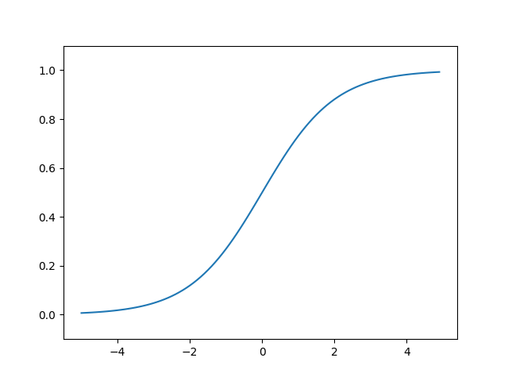

# Chap03 신경망(Neural Network)

앞선 챕터에서는 퍼셉트론을 활용해 복잡한 함수도 표현 가능하다는 점을 알 수 있었다. 하지만 여전히 가중치를 설정하는 작업은 사람이 수동으로 해야 하는 점이 남아있다.

이를 해결하기 위해 신경망이 좋은 해답이 된다.

신경망의 중요한 성질 중 하나는 가중치 매개변수의 적절한 값을 데이터로부터 자동으로 학습하는 능력이 있다는 점이다.

## 3.1 퍼셉트론에서 신경망으로

### 3.1.1 신경망의 예

신경망은 입력층(0층), 은닉층(1층), 출력층(2층)으로 구성된다. 여기서 은닉층은 사람 눈에는 보이지 않는 부분을 말한다.

층 번호는 0부터 시작하는데 그 이유는 파이썬 인덱스와 동일하게 표현하기 위함이다.

### 3.1.2 퍼셉트론 복습

 

간단한 단층 퍼셉트론에 편향을 표시하면 아래와 같이 표기할 수 있다.

 

위 그림은 가중치가 b이고 입력이 1인 뉴런, 즉 x1, x2, 1이라는 3개의 신호가 뉴런에 입력되어, 각 신호에 가중치를 곱한 후 다음 뉴런에 전달되는 구조이다.

위의 수식은 아래와 같이 다시 표현할 수 있다. 조건 분기의 동작(0을 넘으면 1을 출력하고 그렇지 않으면 0을 출력)을 하나의 함수로 나타내고 이 함수를 h(x)로 표현한다.

 

위 식에서 입력 신호의 총합이 h(x)라는 함수를 거쳐 변환되어, 그 변환된 값이 y의 출력이 됨을 보여준다. 이 함수는 입력이 0을 넘으면 1을, 그렇지 않으면 0을 돌려준다.

**※ ↑ 이 부분 추가 이해 필요**

- 위 식에서 x는 x1, x2를 통칭해서 어떤 값이든 입력이 되는 값을 칭하는 것인가?

### 3.1.3 활성화 함수의 등장

위의 h(x)라는 함수와 같이 입력 신호의 총합을 출력 신호로 변환하는 함수를 일반적을 **활성화 함수(Activation function)**라고 한다. '활성화'라는 이름이 말해주듯 활성화 함수는 입력 신호의 총합이 활성화를 일으키는지를 정하는 역할을 한다.

앞서 보았던 식을 다시 표현하면 아래와 같다.

1) a : 가중치가 달린 입력신호와 편향의 총 합

 

2) a를 함수 h()에 넣어 y를 출력하는 흐름

 

활성화 함수의 처리과정을 도식화하면 아래와 같이 표현된다.

 

이해한 바로는 앞서 가중치와 신호로 계산된 b+(w1*x1)+(w2*x2)가 a라는 노드로 계산되고 이를 함수 h()에 넣어 y라는 노드로 출력되는 모습이다. (*여기서 '뉴런 =노드'로 표현된다.)

## 3.2 활성화 함수

앞서 보았던 아래 함수를 잘 들여다보면 입력값(x)이 특정 임계값(여기서는 0)을 경계로 출력값(0~1)이 바뀌는데, 이런 함수를 **계단 함수(Step function)**라고 한다.

 

그래서 ***"퍼셉트론에서는 활성화 함수로 계단함수를 이용한다"*** 라고 할 수 있다.

퍼셉트론은 계단함수를 채용하고 있지만, ***신경망에서는 활성화 함수를 계단함수에서 다른 함수로 변경함***으로써 활용할 수 있다.

### 3.2.1 시그모이드 함수(Sigmoid function)

 

신경망에서는 활성화 함수로 위와 같은 ***시그모이드 함수***를 이용하여 신호를 변환하고, 그 변환된 신호를 다음 뉴런에 전달한다.

### 3.2.2 계단함수 구현하기

[※ 계단함수 구현 _ ch03_src_code_01.py](./src/ch03_src_code_01.py)

이 구현에서 주의할 점은, 인수 x를 실수(부동소수점)만 받아들인다는 점이다. 즉 step_function(3.0)은 계산 가능하지만, <u>넘파이 배열은 인수로 넣을 수 없다.</u>

이를 위해 소스코드를 아래와 같이 수정할 수 있다.

[※ 계단함수 구현(2) _ ch03_src_code_02.py](./src/ch03_src_code_02.py)

위의 코드에서처럼 넘파이 배열의 자료형을 변환할 때는 astype() 메서드를 사용할 수 있다.

### 3.2.3 계단 함수의 그래프

[※ 계단함수 그래프 출력 _ ch03_src_code_03.py](./src/ch03_src_code_03.py)

 

### 3.2.4 시그모이드 함수 구현하기

[※ 시그모이드 함수 구현 _ ch03_src_code_04.py](./src/ch03_src_code_04.py)

이 함수가 정상적으로 동작하는 이유는 **넘파이의 브로드캐스트** 기능 덕분이다.

즉, 넘파이 배열과 스칼라값의 연산을 넘파이 배열의 원소 각각과 스칼라값의 연산으로 바꿔 수행하는 것이다.

[※ 시그모이드 함수 그래프 출력 _ ch03_src_code_05.py](./src/ch03_src_code_05.py)

 

### 3.2.5 시그모이드 함수와 계단 함수 비교

[※ 시그모이드 함수와 계단함수 비교 _ ch03_src_code_06.py](./src/ch03_src_code_06.py)

 

시그모이드 함수는 계단함수와 비교하여 연속적인 곡선형태를 갖는다. 

### 3.2.6 비선형 함수

계단함수와 시그모이드 함수는 *비선형 함수*라는 점에서 공통점을 가진다. (시그모이드 - 곡선, 계단함수 - 구부러진 직선)

**신경망에서는 활성화 함수로 비선형 함수를 사용해야 한다. 그 이유는 선형 함수를 사용하면 신경망 층을 깊게 하는 의미가 없어지기 때문이다**

- h(x) = cx를 활성화 함수로 사용한 3층 네트워크를 예로 들었을 때, y(x) = h(h(h(x)))가 되며, 계산해보면 y(x) = c * c * c * x 처럼 곱셈을 세 번 수행하는, 즉, y(x) = ax (a = c^3)과 동일한 식이 되기 때문이다.

### 3.2.7 ReLU(Rectified Linear Unit) 함수

ReLU는 입력이 0을 넘으면 그 입력을 그대로 출력하고, 0 이하이면 0을 출력하는 함수이다.

 

 

[※ ReLU함수 구현 _ ch03_src_code_07.py](./src/ch03_src_code_07.py)

